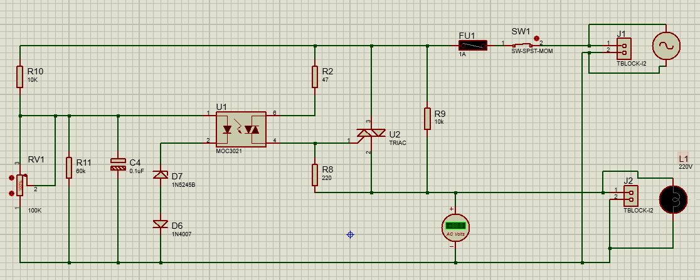

# 💡 AC Light Dimmer Circuit using Opto-TRIAC & TRIAC


An AC mains light dimmer and phase control circuit designed and simulated in **Proteus**. The system controls the AC power delivered to an incandescent lamp load using a potentiometer-driven RC timing circuit, an optoisolated TRIAC driver (**MOC3021**), and a power **TRIAC**.

---

## 📌 Circuit Features & Component Roles

### Key Components
- **MOC3021 (U1):** Optocoupler TRIAC driver providing galvanic isolation between the control stage and high-voltage AC mains.
- **TRIAC (U2):** Bi-directional AC semiconductor switch controlling load power.
- **Potentiometer (RV1) & C4:** Adjustable RC timing circuit determining the firing angle (phase control).
- **Zener Diode (D7 - 1N5245B) & D6 (1N4007):** Threshold detection and shaping network for triggering the optocoupler LED.
- **Protection & Mains:** Fuse FU1, Switch SW1, and terminal blocks J1/J2 for AC line input and lamp load connection.

---

## 📐 Circuit Schematic



---

## ⚡ Principle of Operation

1. **Phase Control:** The AC input voltage charges capacitor C4 through resistor network R10, RV1, and R11.
2. **Triggering:** Adjusting potentiometer RV1 changes the charging rate of C4, varying the time delay before reaching the threshold voltage of D7.
3. **Isolation & Switching:** Once triggered, current flows through the LED inside U1 (MOC3021), firing its internal opto-TRIAC, which subsequently gates the main power TRIAC U2.
4. **Power Regulation:** By controlling the firing angle α within each half-cycle of the AC waveform, the RMS voltage across the lamp J2 is smoothly regulated from OFF to full brightness.

---

## 🚀 How to Run the Simulation
1. Clone or download this repository:
git clone [https://github.com/thienquy-nguyen/ac-light-dimmer-triac-control.git](https://github.com/thienquy-nguyen/ac-light-dimmer-triac-control.git)
2. Launch Proteus Design Suite.
3. Open the ac_dimmer.pdsprj file.
4. Press Play to start the simulation.
5. Adjust potentiometer RV1 percentage to observe changes in load power and lamp illumination.

---

## ✉️ Author & Contact
Thien Quy Nguyen

Automation & Control Engineering Student | Vietnam Aviation Academy (VAA)

Email: quynt.automation@gmail.com

LinkedIn: www.linkedin.com/in/thien-quy-nguyen-a91732440

GitHub: thienquy-nguyen

## 📂 Repository Structure

```text
├── ac_dimmer.pdsprj     # Proteus ISIS design file
├── schematic.png        # Circuit schematic diagram
├── simulation.png       # Simulation result screenshot
└── README.md            # Technical documentation
